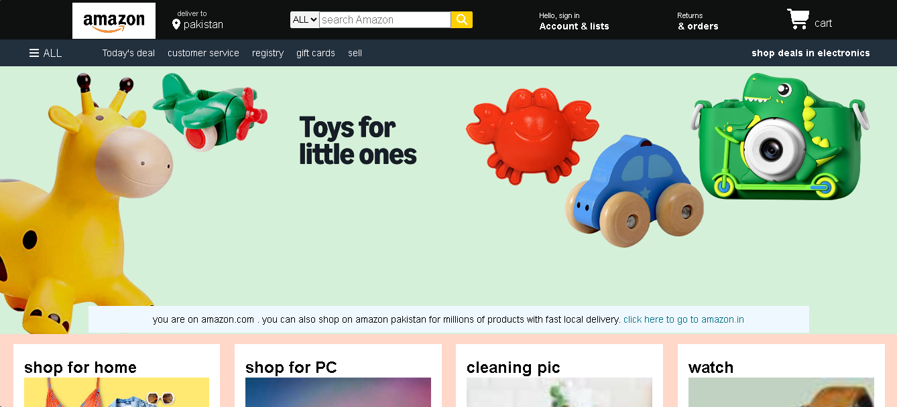

# 🛒 Amazon Clone (HTML & CSS)

This is a frontend Amazon Clone project built using **HTML5** and **CSS3**.  
The project replicates the homepage layout of Amazon to practice real-world website design and frontend development skills.

---

## 🚀 Features

- Responsive Navigation Bar
- Hero Section with Banner
- Product Cards Layout
- Footer Section
- Clean and Structured UI
- Built using only HTML & CSS

---

## 🛠️ Technologies Used

- HTML5
- CSS3 (Flexbox & Grid)

---

## 🎯 Purpose of the Project

This project was created to:

- Improve frontend development skills
- Practice layout design
- Understand real website structure
- Strengthen CSS styling concepts

---

## 📸 Screenshot

---

## 🔮 Future Improvements

- Add JavaScript functionality
- Add Add-to-Cart feature
- Make fully responsive
- Create product detail pages

---

## 👨‍💻 Author

Muhammad Jamal  
Computer Systems Engineering Student  
Frontend Developer | MERN Stack Learner
